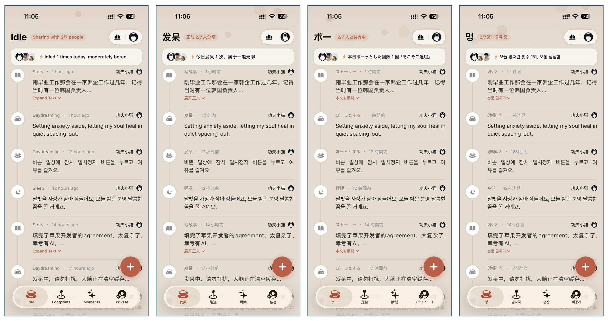

  <a href="README.md">English</a> &nbsp;|&nbsp;
  <a href="README_zh.md">简体中文</a> &nbsp;|&nbsp;
  <a href="README_ja.md"><b>日本語</b></a> &nbsp;|&nbsp;
  <a href="README_ko.md">한국어</a>

 

# 🌍 走哪啦 (ZounaLa) · コミュニティ多言語ローカライズプロジェクト

> **より自然で美しい表現へ。多言語対応にご協力いただいた方に「Ultimate 永久会員」を無料進呈！** 🎁

---

## 📱 プロジェクト概要

**走哪啦 (ZounaLa / ゾウナラ)** は、プライバシー最優先・ゼロ独立サーバー設計を採用した iOS ライフログ＆足跡記録アプリです。街歩きや旅行、日々の散歩、ぼーっとした時間（発呆 / Idle Moments）、大切な人との思い出を美しく記録します。

世界中のユーザーに心温まる最高の体験をお届けするため、アプリ内のボタン、サブタイトル、通知、ウィジェットなどの文言を、**日本語 (日本語)**、**韓国語 (한국어)**、**英語 (English)** 各言語においてより自然でネイティブらしい表現に洗練させたいと考えています。

---

## 🎯 ネイティブの皆様のお力をお借りしたい理由

自動翻訳はある程度のベースラインを提供しますが、文化的な文脈や自然なニュアンス、温かみのある言い回しはネイティブならではの感性が欠かせません：

- **特徴的な概念の自然な翻訳**：「ボーっとした時間（発呆 / Spacing out）」、「足跡チェックイン」、「プライベート空間」などの心地よい表現。
- **モバイルUIに最適な文字量**：ボタンやロック画面ウィジェット、通知カード内で見やすく美しく収まる簡潔なテキスト。
- **正確で親切な権限説明**：カメラ、写真ライブラリ、位置情報、Bluetooth権限の利用目的を分かりやすく丁寧に伝える表現。

---

## 🎁 貢献者特典：「Ultimate 永久会員」を無料プレゼント

質の高いローカライズへの貢献に対し、心からの感謝を込めて：

✨ **Pull Request（または有益な翻訳改善の提案）がレビュー・マージされた方全員に、App 内のすべての高度な機能を永久に利用できる「Ultimate 永久会員（$24.99+ 相当）」の有効化コードをプレゼントいたします！**

### 🔑 有効化コードの受け取り手順：
1. **ご自身のアカウント ID を確認**：
   - iPhone で **走哪啦 (ZounaLa)** アプリを開きます；
   - **設定 (Settings)** ➔ **Ultimate 会員有効化 (Ultimate Membership)** を開きます；
   - 画面に表示されている **8桁のアカウント ID (Your Account ID)**（例: `886333C5`）をタップしてコピーします。
2. **PR / コミット時に記載**：
   - Pull Request 作成時、**PR の説明欄**（またはコミットメッセージ）に以下を記載してください：
     - **8桁のアカウント ID**：（例：`Account ID: 886333C5`）
     - **ご連絡先メールアドレス**：（例：`Email: yourname@example.com`）
3. **メールで有効化コードを受信**：
   - チームによるレビューと承認（Approval）後、個別有効化コードを発行し、記載いただいたメールアドレス宛にお送りします！

---

## 📂 編集対象ファイル

本リポジトリで編集するメインファイル：

- [`Localizable.xcstrings`](Localizable.xcstrings) — Apple 標準の **Xcode String Catalog**（JSON形式）。**日本語 (`ja`)**、**韓国語 (`ko`)**、**英語 (`en`)**、**簡体字中国語 (`zh-Hans`)** のすべての UI 文言が含まれています。

---

## 🛠 参加・貢献方法

### 方法 1: Xcode を使用（iOS デベロッパー推奨）
1. 本リポジトリを Fork してローカルにクローンします；
2. **Xcode 15 以降** で [`Localizable.xcstrings`](Localizable.xcstrings) を開きます；
3. Xcode のビジュアル String Catalog エディタで未翻訳や改善が必要なキーを編集・保存します；
4. コミットして Pull Request を作成・送信します。

### 方法 2: 任意のコード・テキストエディタを使用（VS Code、Cursor、Sublime など）
1. 本リポジトリを Fork してクローンします；
2. お好みのエディタで [`Localizable.xcstrings`](Localizable.xcstrings) を開きます；
3. 該当の文言エントリ内にある言語コード（`"ja"`、`"ko"`、`"en"` など）の `"value"` を更新します；
4. JSON の構文にエラーがないか確認します；
5. コミットして Pull Request を送信します。

### 方法 3: GitHub Issue で提案
Git や PR の操作に不慣れな場合：
1. [GitHub Issues](https://github.com/zouna-la/localization/issues) で新規 Issue を作成します；
2. 対象の原文（中国語/英語キー）と、提案する自然な翻訳を記載してください；
3. 特典送信用に **アカウント ID** と **メールアドレス** を忘れずに記載してください！

---

## 💡 翻訳時のガイドライン

- **フォーマット指定子の保持**：動的な数値や日付を正しく表示するため、`%@`、`%lld`、`%1$@`、`%2$@`、`%d` などのプレースホルダーはそのまま残してください。
- **UI の簡潔さを維持**：スマートフォンの画面領域は限られています。直訳で長くなりすぎないよう、簡潔で自然な表現を心がけてください。
- **親しみやすく心地よいトーン**：ZounaLa は温かみのあるライフスタイルアプリです。丁寧で前向きな心地よい言葉遣いを推奨します。

---

## 🤝 お問い合わせ・フィードバック

文脈や用語について不明点がある場合は、お気軽に [GitHub Issues](https://github.com/zouna-la/localization/issues) でご質問ください。

ZounaLa を世界中のユーザーにとってより素晴らしいアプリにするためのご協力に心より感謝申し上げます！❤️
